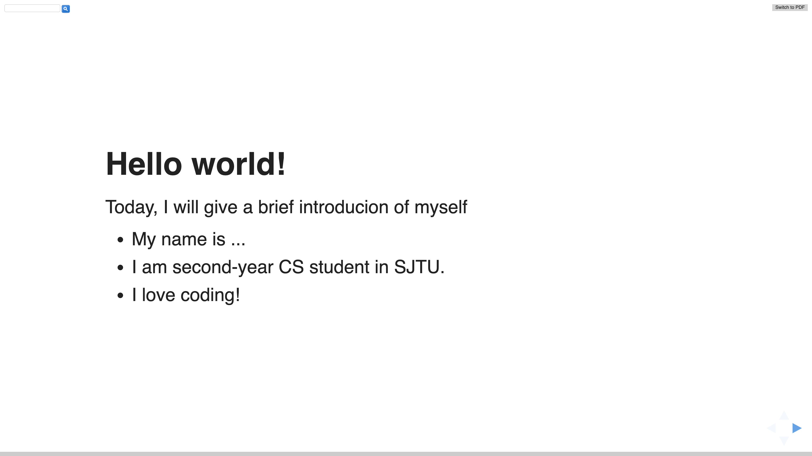
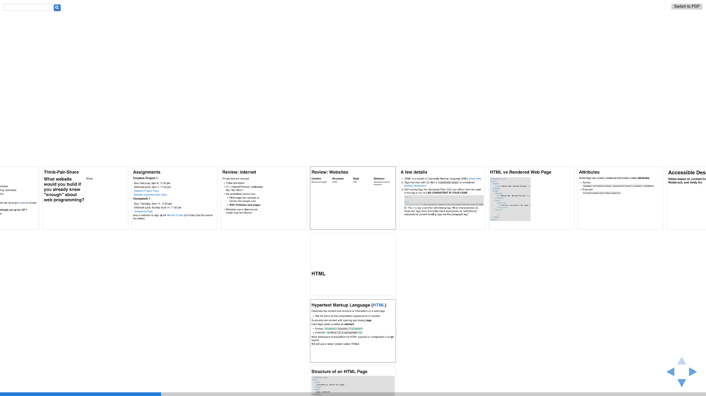
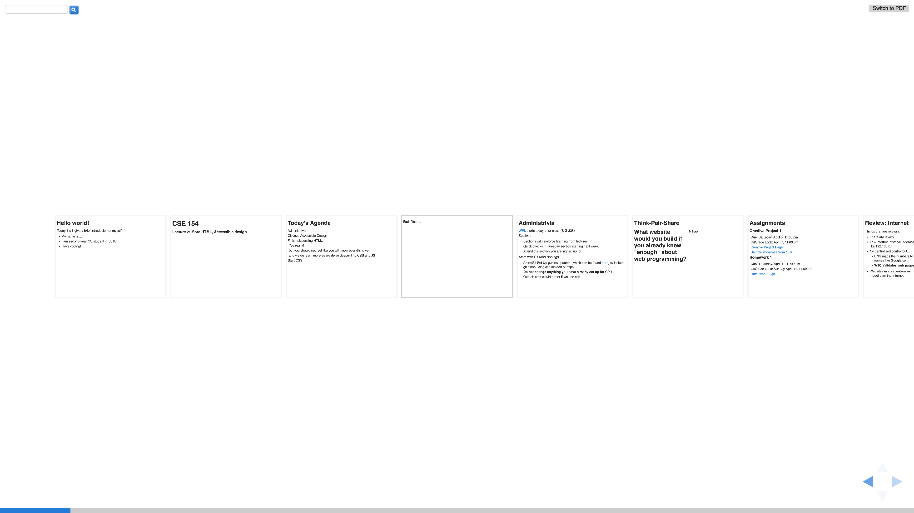
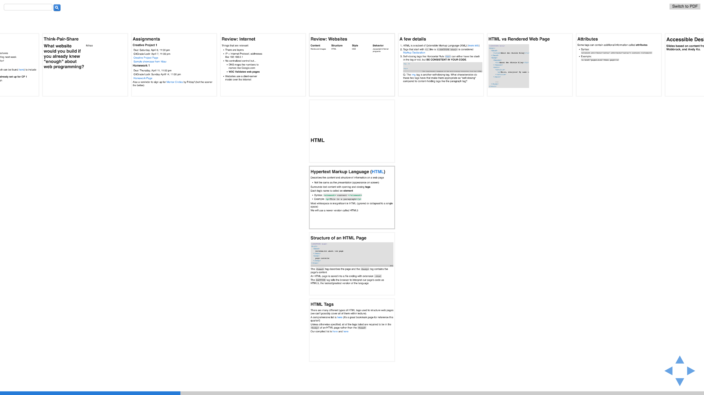

# Use html to create your slides!

## Overview

This is the code to create your own slides use html. And `index.html` in this repository is a sample html adopted from [UW CSE 154 Web Programming](https://courses.cs.washington.edu/courses/cse154/19sp/calendar/calendar.html).

## Dependencies

- Your favourite editor (Vscode, Atom, Sublime, etc.)
- A web browser (Chrome, Firefox, IE, etc.)

## Usage 

### Keyboard

- Press 'f': full screen mode

  

- Press 'esc': thumbnail mode
  

- Press 'b': go black

- Press ’n’: go to next slide

### Class meanings

-  `fragment`: a fragment will move in

    ```html
    <p class="fragment">Start CSS</p>
    ```

-  `space-left fragment`: a fragment will move in preceding a space

    ```html
    <p class="space-left fragment">and we do learn more as we delve deeper into CSS and JS</p>
    ```

-  `no-bullets`: no bullet for unordered list

    ```html
    <ul class="no-bullets">
    <li>Sections will reinforce learning from lectures</li>
    <li>Quick checks in Tuesday section starting next week</li>
    <li>Attend the section you are signed up for!</li>
    </ul>
    ```

-  `side-by-side`: On left side and right side

    ```html
    <div class="side-by-side">
            <h2>What website would you build if you already knew "enough" about web programming? </h2>
            <p>I love Isabella!</p>
    </div>
    ```

-  `space-left`: add left space

    ```html
    <p class="space-left">Due: Saturday, April 6, 11:00 pm</p>
    ```

- `space-right`: add right space

    ```html
    <p class="space-right">Due: Saturday, April 6, 11:00 pm</p>
    ```

-  `medium-small-font`: small font

    ```html
    <p class="medium-small-font">Due: Saturday, April 6, 11:00 pm</p>
    ```

### Section meaning

- One section represents one horizontal slide. 

  ```html
  <div class="reveal">
      <!-- Any section element inside of this container is displayed as a slide -->
      <div class="slides">
        <section>
  	      The first slide. 
        </section>
        <section>
    	    The second slide. 
        </section>
    	</div>
  </div>
  ```

  

- If there are more than one section inside one section, there are vertial slides. 

    ```html
    <section>
        <section>
        The first vertical slide. 
    </section>
        <section>
        The second vertical slide. 
    </section>
    </section>
    ```

    

## Contributors

Most of the code is adopted from [**UW CSE 154 Web Programming**](https://courses.cs.washington.edu/courses/cse154/19sp/calendar/calendar.html) and I modified part of it to better create your own slides. 